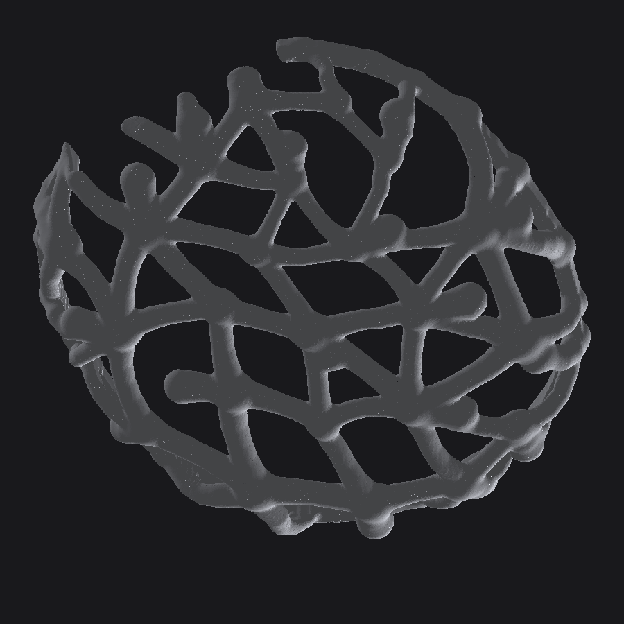

# Накладки на чашки AirPods Max

Параметрический генератор накладок на внешние чашки AirPods Max. Два стиля,
в каждом — две зеркальные детали; примерочное кольцо общее.

* **cobra** — потёкший металл: жилы с наплывами в узлах и висящими каплями;
* **roses** — розы на шипастой лозе: толстая гладкая лоза, процедурные
  цветы, листья и шипы.

Стиль roses сделан по мотивам известного приёма «розы и шипы», а не срисован
с чьей-то готовой модели: и лоза, и цветы строятся кодом с нуля.



Геометрия строится генератором `cobra_x.py`: сеть жил раскладывается по
развёртке поверхности чашки, собирается в поле расстояний (SDF) и вынимается
марширующими кубами. На выходе — замкнутая манифолдная сетка, слайсер берёт
её без ремонта.

Гладкость поверхности держится на трёх вещах:

* жила приходит в растр **цепочкой звеньев с жёстким минимумом** — плавное
  объединение надувало бы горбик на каждом стыке (в первой версии на это
  уходило 15 % материала, и на превью это читалось как шагрень);
* сглаживание **Тобина** (λ/μ, 5 проходов) снимает воксельную лесенку, но не
  ужимает деталь, как лапласово;
* шаг сетки 0.36–0.40 мм: грань меша получается мельче, чем сопло или пиксель
  засветки, стык соседних граней по 95-му перцентилю — 19–23°, и это уже
  кривизна самой жилы, а не рельеф.

---

## Файлы

| Файл | Что это |
|---|---|
| `stl/cobra-x_right.stl` / `.3mf` | правая чашка, стиль cobra |
| `stl/cobra-x_left.stl` / `.3mf` | левая чашка, стиль cobra |
| `stl/roses_right.stl` / `.3mf` | правая чашка, стиль roses |
| `stl/roses_left.stl` / `.3mf` | левая чашка, стиль roses |
| `stl/cobra-x_fit-gauge.stl` / `.3mf` | примерочное кольцо (печатать первым) |
| `cobra_x.py` | генератор: любые размеры и рисунок |

Кольцо одно на оба стиля — внутренняя поверхность у накладок одинаковая.

Все три модели уже стоят на столе в печатной ориентации — пояском вниз,
куполом вверх, Z = 0, центр в нуле. В слайсере не надо ни крутить, ни ронять
на стол: импорт → поддержки → нарезка.

Габарит: cobra ≈ 94 × 106 × 21 мм и ≈ 17 см³ (≈ 21 г PLA), roses
≈ 97 × 110 × 23 мм и ≈ 22 см³ (≈ 27 г PLA) на чашку. Жила: 2.4 мм радиус, ≈ 4.4 мм ширина по контакту, 3.5 мм над
поверхностью чашки; в узлах металл «натекает» наплывом.

---

## Сначала — примерка

Размеры чашки взяты по общедоступным габаритам AirPods Max, а не по
3D-скану конкретного экземпляра, поэтому **сначала печатается
`cobra-x_fit-gauge`** — кольцо высотой 8.5 мм с той же внутренней
поверхностью, что у накладки. Десять минут печати и два грамма пластика.

* садится с лёгким щелчком и не болтается → печатайте накладки как есть;
* туго / не доходит → `--clearance 0.5`;
* болтается → `--clearance 0.2`, при необходимости померьте чашку
  штангенциркулем и задайте `--cup-w` / `--cup-h`.

---

## Печать с телефона (приложение Anycubic)

Мобильное приложение Anycubic принимает **STL** (лимит 2 ГБ) и синхронизирует
файл с настольной версией. Но нарезка с телефона не поддерживается: чтобы
запустить печать, файл режется в Anycubic Slicer Next на компьютере, а оттуда
уходит на принтер через тот же аккаунт Anycubic Cloud.

Порядок:

1. на телефоне открыть файл `stl/cobra-x_fit-gauge.stl` (или чашку) и
   сохранить в «Файлы»;
2. в приложении Anycubic — загрузить STL в облако;
3. на компьютере в Anycubic Slicer Next модель уже в облачной библиотеке:
   поддержки → нарезка → печать на принтер.

Модели специально положены на стол и развёрнуты — на шаге нарезки остаётся
только включить древовидные поддержки.

### Профиль для Kobra X

Стол 260 × 260 мм: обе чашки (94 × 106 мм каждая) и кольцо встают на стол
одновременно, одной печатью. Слайсер — Anycubic Slicer Next, он на Orca,
названия параметров ниже орковские.

| Параметр | PLA / PETG | TPU 95A |
|---|---|---|
| Слой | 0.16 (для хрома — 0.12) | 0.2 |
| Первый слой | 0.25 | 0.25 |
| Сопло / ширина линии | 0.4 / 0.42 | 0.4 / 0.44 |
| Стенки (wall loops) | 4 | 3 |
| Верх / низ | 5 / 4 | 4 / 3 |
| Заполнение | 15 %, gyroid | 12 %, gyroid |
| Внешний периметр | 90 мм/с | 25 мм/с |
| Внутренние / заполнение | 200 / 250 мм/с | 40 мм/с |
| Сопло / стол | 215 / 60 (PETG 240 / 80) | 225 / 50 |
| Обдув | 100 % со 2-го слоя | 60 % |
| Поддержки | tree (organic), только внутрь чаши, зазор по Z 0.2, по XY 0.35, порог 40° | то же |
| Brim | не нужен | 3 мм |
| Шов | scarf joint seam | random |
| Z-hop | 0.2 мм | 0.2 мм |

Мелочи, которые экономят катушку:

* «Slow down for overhangs» включить — купол изнутри висит;
* «Avoid crossing walls» включить — сопло не сбивает тонкие жилы;
* 600 мм/с с этой деталью не нужны: она вся из коротких дуг, на скорости
  выше 300 мм/с рывки видно на поверхности, а под хром это лишняя шкурка;
* **TPU через 4-цветный узел не подавать** — только прямой подачей с внешней
  катушки, иначе гибкий пруток сложится в буфере.

---

## Режимы печати

**FDM.** Ориентация уже задана: поясок на стол, купол вверх.

| Параметр | Значение |
|---|---|
| Слой | 0.16–0.2 мм |
| Сопло | 0.4 мм |
| Периметры | 4–5 (жила 4.4 мм пропечатывается насквозь) |
| Заполнение | 15 % |
| Поддержки | древовидные, **только внутрь чаши**, зазор 0.2 мм |
| Материал | TPU 95A (садится и снимается многократно) или PLA / PETG |

Купол изнутри — нависание: без поддержек центральная часть провиснет.
Древовидные поддержки внутри чаши отламываются целиком.

**Смола (SLA/DLP).** Наклон 30–40°, поддержки на внутреннюю сторону, кончик
0.35 мм. Поверхность выходит зеркальнее, чем у FDM, — под хром это лучший
вариант. Берите прочную смолу (tough / ABS-like): стандартная хрупкая даст
скол жилы при надевании.

---

## Стиль roses

```bash
python3 cobra_x.py --style roses --side both --preview
```

Лоза кладётся по той же развёртке, что и жилы cobra, только ячейка крупнее
(26 мм) и пруток толще. Дальше по ней расставляется декор:

* **розы** — в узлах лозы: три яруса лепестков вокруг бутона. Лепесток это
  кусок сферической оболочки, вогнутой стороной к оси цветка; пятно
  эллиптическое — широкое по завитку и узкое по кругу, поэтому между
  лепестками остаётся канавка, а не сплошной блин. Ярусы раскрываются
  наружу (17° / 45° / 64°) и довёрнуты друг относительно друга. Диаметр
  цветка ≈ 1.6 × `--rose-size`, по умолчанию ≈ 13 мм;
* **листья** — заострённая линза с центральной жилкой, кончик приподнят;
* **шипы** — конические капсулы, торчат из лозы наружу и слегка по ходу.

Каждая роза сидит на коротком стебле, вросшем в лозу, — цветок не может
оторваться при нарезке. В верхнем окне под дужку и колесо декор не растёт.

| Ключ | По умолчанию | Смысл |
|---|---|---|
| `--roses` | 0.70 | доля узлов лозы с цветком |
| `--rose-size` | 8.0 | радиус розы, мм |
| `--petal` | 1.4 | толщина лепестка, мм |
| `--leaves` | 22 | число листьев |
| `--thorns` | 38 | число шипов |

Печать: лепестки нависают, поэтому поддержки нужны **не только от стола, а
везде** — они снимаются с внешней стороны легко. На FDM кончики шипов выйдут
притупленными (0.4 мм сопло физически не сделает иглу); на смоле шипы и
лепестки получаются как на картинке. Слой для roses — 0.12–0.16 мм, иначе
лепестки сливаются.

Разрешение сетки для этого стиля важно: `--voxel` крупнее 0.45 мм съедает
лепестки. Файлы в `stl/` собраны на 0.36 мм.

---

## Откуда берётся глянец

Печать сама по себе зеркала не даёт — глянец это финиш. Геометрия под него
подготовлена: сечение жил круглое, стыки залиты наплывами, поверхность
сглажена по Тобину (без «лесенки» вокселей и без граней, за которые
цепляется блик).

Дальше по возрастанию результата:

1. **Смола + хром-краска.** Печать смолой, лёгкая шкурка 1500, Molotow
   Liquid Chrome или Montana Chrome в два тонких слоя.
2. **FDM + грунт-филлер.** Грунт → шкурка 800 → 1500 → та же хром-краска.
   Слои сопла нужно вывести грунтом, иначе они видны сквозь хром.
3. **Гальваника / вакуумная металлизация** в мастерской — то самое зеркало
   с фотографии, но это уже сторонняя услуга.

Полировать до печати нечего: блеск даёт покрытие, а не пластик.

---

## Посадка и защёлка

Держится тремя вещами: юбка заходит на 7 мм на борт, сплошной поясок по
нижней кромке пружинит и обхватывает борт, внутренний буртик 0.45 мм заходит
под перегиб — это и есть щелчок. Для жёсткого PLA буртик лучше убрать
(`--lip 0`). Сверху окно 44 мм — под дужку, Digital Crown и кнопку
шумоподавления.

---

## Генератор

```bash
pip install numpy scipy scikit-image
python3 cobra_x.py --side both --preview        # обе чашки + PNG-превью
python3 cobra_x.py --side gauge                 # примерочное кольцо
```

| Ключ | По умолчанию | Смысл |
|---|---|---|
| `--cup-w`, `--cup-h` | 84, 98 | габарит чашки, мм |
| `--cup-n` | 2.35 | «прямоугольность» контура |
| `--dome` | 9.0 | выпуклость внешней поверхности, мм |
| `--clearance` | 0.35 | зазор до чашки, мм |
| `--skirt` | 7.0 | заход юбки на борт, мм |
| `--rim` | 3.0 | высота сплошного пояска, мм |
| `--lip` | 0.45 | буртик-защёлка, мм |
| `--window` | 22.0 | полуширина верхнего окна, мм |
| `--cell` | 15.0 | размер ячейки сети, мм |
| `--strut` | 2.4 | радиус жилы, мм |
| `--rib-core` | 1.05 | подъём оси жилы над чашкой, мм |
| `--blend` | 1.45 | наплыв металла в стыках, мм |
| `--node-blob` | 1.18 | во сколько раз узел толще жилы |
| `--prune` | 0.28 | доля выброшенных рёбер |
| `--drips` | 18 | висящие «потёки» |
| `--seed` | 7 | зерно рисунка — меняет узор целиком |
| `--voxel` | 0.40 | шаг сетки: меньше — глаже и тяжелее файл |

Ещё толще и текучее:

```bash
python3 cobra_x.py --side both --strut 2.9 --blend 2.0 --cell 17 --node-blob 1.3
```

Тоньше и ажурнее:

```bash
python3 cobra_x.py --side both --strut 1.8 --blend 0.9 --cell 12 --prune 0.36
```

Другой узор — просто другое зерно: `--seed 42`.
Генерация обеих чашек — около 20 секунд.
